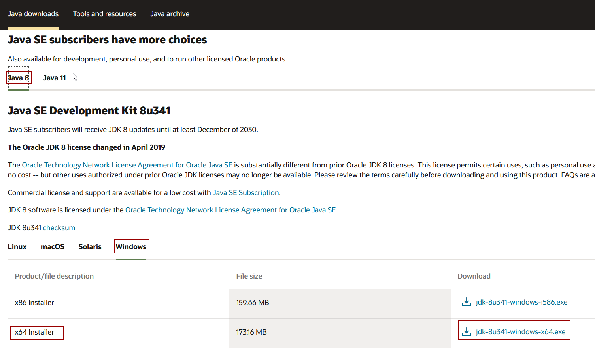
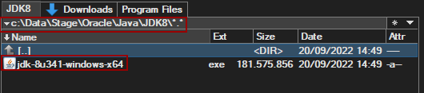
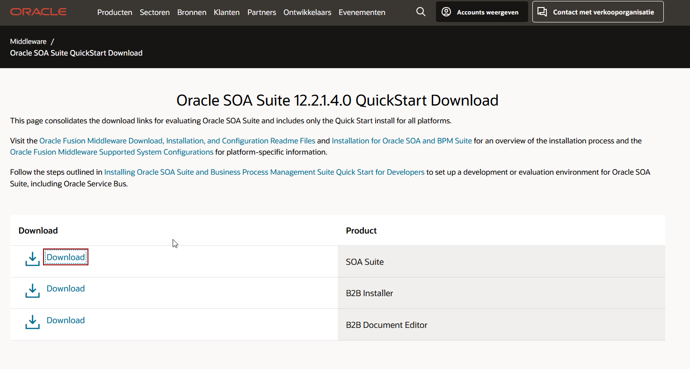
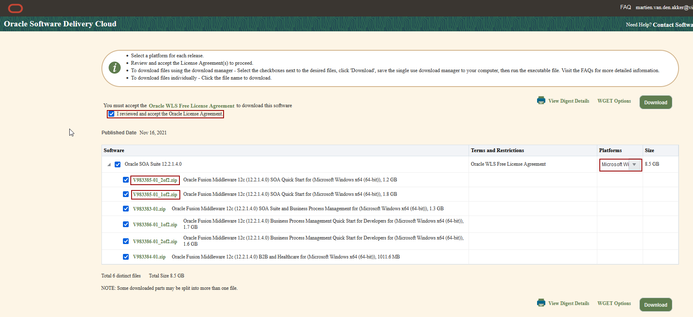

# Scripted Install of Oracle SOA Quickstart on Windows

## Download

### Oracle JDK 8
Download the most recent Oracle JDK 8 from [Oracle Software Delivery Cloud](https://www.oracle.com/java/technologies/downloads/#java8-windows).
Find the Java SE, Java 8 part and download the _x64 Installer_ for Windows:

Copy the download to a stage folder:

The script expects the download in the _C:\Data\Stage\Java\JDK8_ folder. Which you can adapt of course.

### Oracle SOA Quickstart 12.2.1.4
The landing page for the download of SOA Quickstart can be found here: [SOASuite Download](https://www.oracle.com/nl/middleware/technologies/soasuite/downloads.html#). But it will direct you to the correct
Click on the download link for SOA Suite:

This will direct you to the proper page in the _Oracle Software Delivery Cloud_:

Select _Microsoft Windows_ under _Platforms_, and check the Oracle License Agreement. Then download the first two zips *Oracle Fusion Middleware 12c (12.2.1.4.0) SOA Quick Start for (Microsoft Windows x64 (64-bit))*, being _V983385-01_1of2.zip_ and _V983385-01_2of2.zip_ .

The script expects the following files:
| File |  Location | Remarks|
|------|-----------|--------|
| jdk-8u341-windows-x64.exe | %SOFTWARE_HOME%\Oracle\Java\JDK8 | |
| V983385-01_1of2.zip | %SOFTWARE_HOME%\Oracle\SOA_QS | Contains _fmw_12.2.1.4.0_soa_quickstart.jar_ |
| V983385-01_2of2.zip | %SOFTWARE_HOME%\Oracle\SOA_QS | Contains _fmw_12.2.1.4.0_soa_quickstart2.jar_ |
| installSoaQS.bat | Script Location | The actual install script.|
| soaqs1221_silentInstall.rsp.tpl | Script Location | Template file for the installer response file.|
| jdev.conf | Script Location | Jdeveloper config file, that refers to non-default  environment variables refering the home folder. To prevent settings conflicts with a studio install of JDeveloper with the same version. |
| ide.conf | Script Location | IDE config file, to set non-default settings for Heap and Garbage Collector.|

Where:
* %SOFTWARE_HOME% = c:\Data\Stage (Set in the script).
* Script Location: location of the script, found in this Git Repository [scripts/windows/soa_qs](../../scripts/windows/soa_qs) 

It targets the following locations:
| Environment Variable | Location | Remarks |
|------|-----------|--------|
| JAVA_HOME | c:\Program Files\Java\jdk1.8.0_341 | If this location is not set, then it will try to install the Oracle JDK 8. And sets this variable. |
| FMW_HOME | C:\oracle\JDeveloper\12214_SOAQS | Install location of JDeveloper/SOA Quickstart. Should be a location without spaces. |

