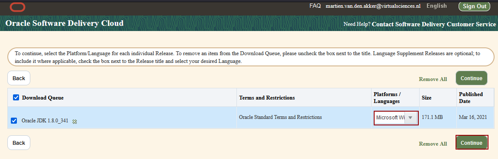
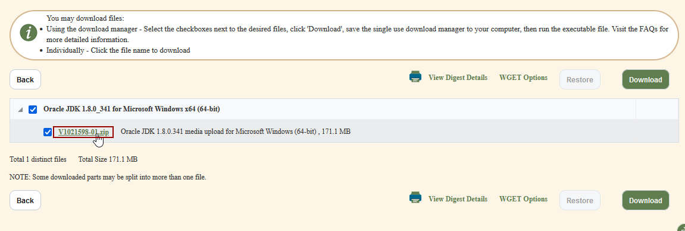
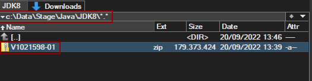

# Scripted Install of Oracle SOA Quickstart on Windows

## Download

### Oracle JDK 8
Download the most recent Oracle JDK 8 from [Oracle Software Delivery Cloud](https://edelivery.oracle.com), (Free) Oracle account required.

In the search box search for the _Release_ of _Oracle JDK 1.8.0_:

Select the the most recent version of  _Oracle JDK 1.8.0_, in this example  *Oracle JDK 1.8.0_341*. This adds the option to the cart.
Then click on _View Items_ in the cart and then on _Continue_.

In the next screen select _Microsoft Windows_ and click on _Continue_:

After this a screen appears in which you should accept the download/license agreement. After you do, you get to the following page:

Here, click on the link of the zip file, in this example _V1021598-01.zip_, to download it (no need to use the Download button).

Place the file  in a staging folder like:

The script expects it in the c:\Data\Stage\Java\JDK8 folder. Which you can adapt of course.

### Oracle SOA Quickstart 12.2.1.4

[SOASuite Download](https://www.oracle.com/nl/middleware/technologies/soasuite/downloads.html#)
